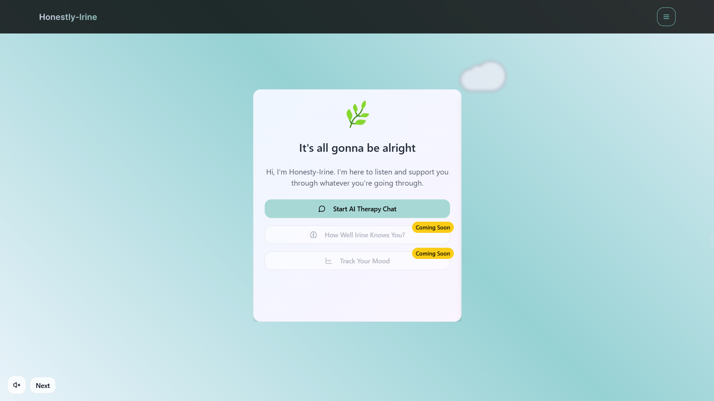
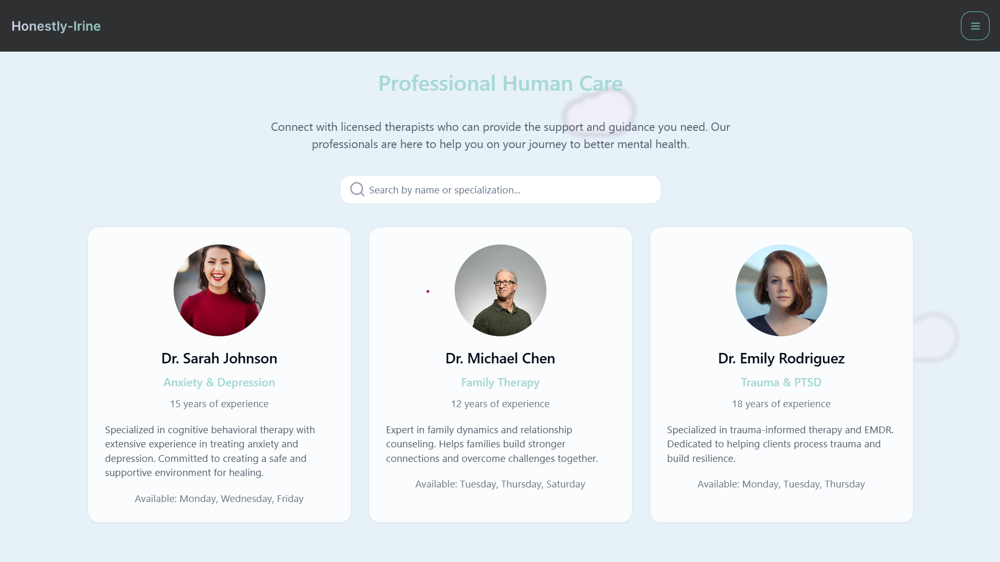
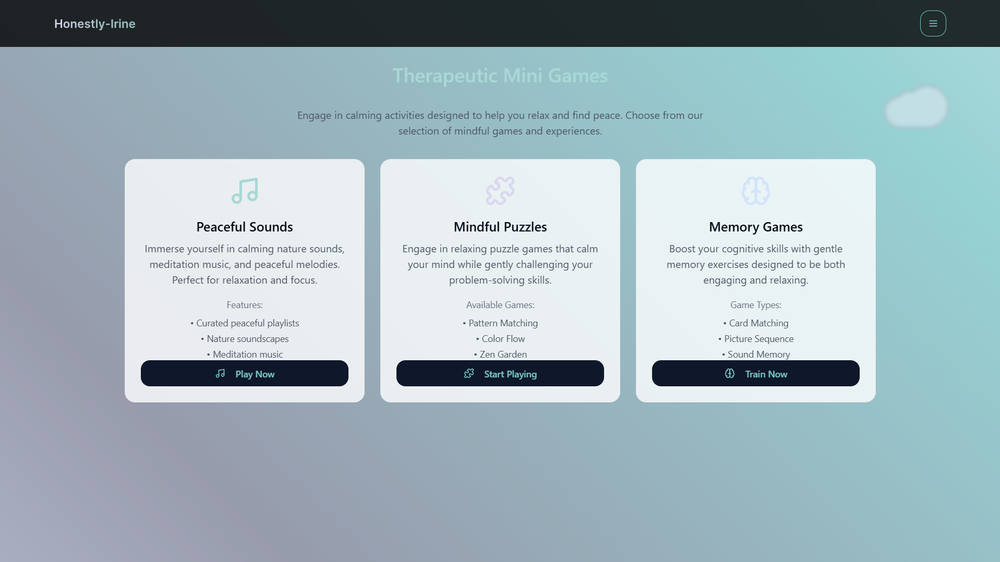
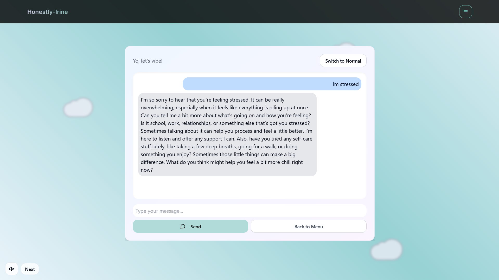
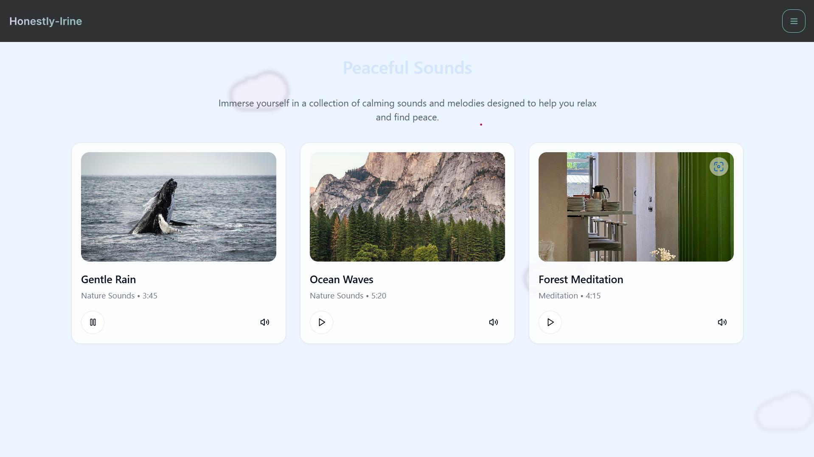

# Honestly-Irine

## About the Project
  
Welcome to **Honestly-Irine**, a therapeutic web application designed to provide emotional support, relaxation, and mental well-being. Our mission is to create a safe, supportive space where users can connect with an AI therapist, engage in calming activities, and track their mood. Join us on this journey towards better mental health and a more peaceful life with Honestly-Irine!

### Overview
- **AI Therapy Chat**: Engage in real-time conversations with an AI therapist for emotional support.
- **Therapeutic Mini Games**: Access calming activities like Peaceful Sounds, Mindful Puzzles, and Memory Games to relax and focus.
- **Mood Tracking**: Coming soon—track your emotional state over time to monitor well-being.
- **User-Friendly Design**: Built with modern web technologies and best practices for a seamless experience.
- **Supportive Features**: Personalized responses and a variety of therapeutic tools to aid mental health.

### Best Practices
- Adhering to clean and consistent naming conventions.
- Minimizing unnecessary object creation for performance optimization.
- Avoiding redundant code blocks and initialization.
- Organizing code by grouping components and modules by functionality.
- Following recommended web development architecture.
- Proper integration of APIs and third-party libraries.
- Utilizing proven tools and frameworks for stability and scalability.

## Web App Project Setup
This guide walks you through setting up the Honestly-Irine web app project.

### Prerequisites
- React installed on your machine.
- Git installed on your machine.
- A modern web browser for testing.

### Getting Started
1. Clone the repository:
   ```bash
   git clone https://github.com/Sameer-Mardani/Irine-Therapy-chat-bot.git


2. Navigate to the project directory:
   ```bash
   cd Irine-Therapy-chat-bot
3. Install dependencies:
   ```bash
   npm install
4. Start the development server:
   ```bash
   npm start
## Gallery
Explore the key features and interface of Honestly-Irine through these screenshots. Each image highlights a unique aspect of the application, showcasing its therapeutic design and user experience.

### Welcome and Main Interface
- **Home Screen**
    
  *The main entry point offering options to start AI therapy, how well irine knows you?, or track mood.*
  
### Professional Human Care
- **Professional Human Care**
    
  *The interactive AI therapy chat where users can express their feelings and receive personalized support, mimicking human care.*

### Therapeutic Features
- **Therapeutic Mini Games**
    
  *A selection of calming mini-games like Peaceful Sounds, Mindful Puzzles, and Memory Games.*

- **Chat Interface**
    
  *The interactive AI therapy chat where users can express their feelings and receive support.*

- **Peaceful Sounds**
    
  *A soothing audio experience with options like Gentle Rain, Ocean Waves, and Forest Meditation.*
  
## Developers
- **Frontend**: Sameer Mardani, Afreen Hossain, Amina Yameen
- **Backend-Database**: Aghar Raza
- **AL/ML**: Devesh
- **Risk Analyst**: Aneesh Sai
